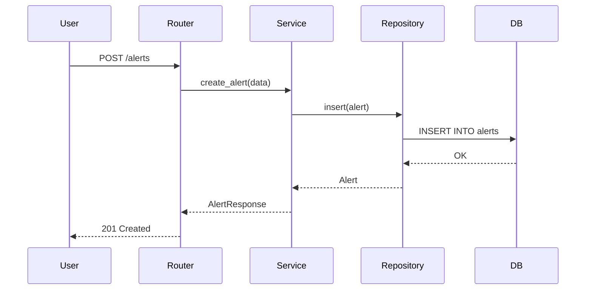
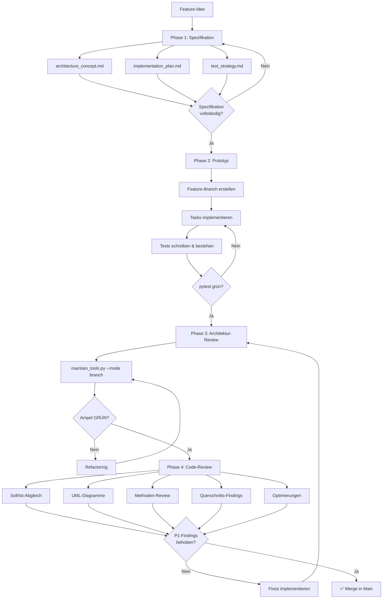

# 🎯 Feature Development Workflow

Dieses Dokument beschreibt den verbindlichen **4-Phasen-Prozess** für die Entwicklung neuer Features. Jedes Feature durchläuft die Phasen **Spezifikation → Prototyp → Architektur-Review → Code-Review**, bevor es in den Main-Branch gemerged wird. Der Prozess stellt sicher, dass Features vollständig spezifiziert, automatisiert getestet, architektonisch sauber und dokumentiert abgenommen werden.

> **Referenz:** Das Alerts-Feature wurde als erstes Feature nach diesem Verfahren entwickelt und dient als Vorlage (siehe `docs/alert_architecture_concept.md`, `docs/alert_implementation_plan.md`, `docs/alert_codereview.md`).

---

## 📋 Phase 1: Spezifikation

**Ziel:** Fachliche und technische Anforderungen vollständig dokumentieren, bevor eine Zeile Code geschrieben wird.

### Artefakte erstellen

Für jedes Feature werden folgende Dokumente im `docs/`-Verzeichnis des Projekts erstellt:

| Artefakt | Datei | Pflicht |
|----------|-------|---------|
| Architekturkonzept | `docs/<feature>_architecture_concept.md` | Ja |
| Implementierungsplan | `docs/<feature>_implementation_plan.md` | Ja |
| Deployment-Checkliste | `docs/<feature>_deployment.md` | Ja, wenn Infrastruktur-Änderungen |
| Teststrategie | `docs/<feature>_test_strategy.md` | Optional |

### Architekturkonzept (`_architecture_concept.md`)

Das Architekturkonzept beschreibt das **Was** und **Wie** auf fachlicher und technischer Ebene. Mindest-Sektionen:

| Sektion | Inhalt |
|---------|--------|
| Übersicht & Ziele | Was soll das Feature leisten? Welches Problem löst es? |
| Datenmodell | Neue Tabellen, Felder, Relationen (ER-Diagramm empfohlen) |
| Services & Klassen | Neue Module, Klassen und deren Verantwortlichkeiten |
| API-Schnittstellen | Neue Endpoints, Request/Response-Schemas |
| Security & Privacy | Authentifizierung, Autorisierung (RBAC), Datenvalidierung, PII-Schutz |
| Phasen-Roadmap | Aufteilung in Implementierungsphasen (z.B. Phase 1: Grundgerüst, Phase 2: Business-Logik) |
| Abhängigkeiten | Externe Services, bestehende Module, Konfiguration |

### Implementierungsplan (`_implementation_plan.md`)

Der Implementierungsplan beschreibt das **Was** auf Task-Ebene. Jeder Task ist eine konkrete, abarbeitbare Aufgabe mit Checkbox:

```markdown
## Phase 1: Grundgerüst

- [ ] Task 1.1: Datenbank-Modelle erstellen (`models/`)
- [ ] Task 1.2: Repository-Klasse implementieren (`repositories/`)
- [ ] Task 1.3: API-Router erstellen (`routers/`)

## Phase 2: Business-Logik

- [ ] Task 2.1: Service-Klasse implementieren
- [ ] Task 2.2: Unit Tests schreiben
```

### Teststrategie (`_test_strategy.md`, optional)

Falls das Feature komplexe Testszenarien erfordert, wird die Teststrategie separat dokumentiert:

*   **Unit Tests:** Welche Klassen/Methoden werden getestet?
*   **Integration Tests:** Welche Endpoints und Datenflüsse?
*   **E2E Tests:** Welche User-Journeys werden end-to-end validiert?

### Deployment-Checkliste (`_deployment.md`, pflicht bei Infrastruktur-Änderungen)

Wenn das Feature neue Azure-Komponenten, Environment-Variablen, DB-Änderungen, Pods oder externe Abhängigkeiten einführt, ist eine Deployment-Checkliste Pflicht. Vorlage und Pflicht-Sektionen siehe `standards/docs/deployment_checklist.md`.

### Abnahme-Checkliste Phase 1

- [ ] Architekturkonzept vollständig (alle Mindest-Sektionen vorhanden)?
- [ ] Implementierungsplan mit konkreten Tasks und Checkboxen?
- [ ] Phasen-Roadmap definiert?
- [ ] Datenmodell dokumentiert (Tabellen, Felder, Relationen)?
- [ ] API-Schnittstellen definiert (Endpoints, Schemas)?
- [ ] Security-Aspekte (Auth, RBAC, Validierung) berücksichtigt?
- [ ] Abhängigkeiten und Konfiguration identifiziert?
- [ ] Deployment-Checkliste erstellt (falls Infrastruktur-Änderungen)?

---

## 🤖 Phase 2: Prototyp (Claude Code)

**Ziel:** Funktionierende Implementierung, validiert gegen automatische Tests.

### Vorgehen

1.  **Kontext laden:** Claude Code erhält die Spezifikation (Architekturkonzept + Implementierungsplan) als Kontext.
2.  **Feature-Branch erstellen:** Alle Änderungen in einem dedizierten Feature-Branch (`feature/<feature-name>`).
3.  **Tasks abarbeiten:** Jeden Task aus dem Implementierungsplan der Reihe nach umsetzen und die Checkbox abhaken.
4.  **Tests schreiben:** Automatische Tests parallel zur Implementierung schreiben.
5.  **Tests bestehen lassen:** `pytest` muss grün sein, bevor die Phase abgeschlossen wird.
6.  **E2E validieren:** Falls eine Teststrategie existiert, die definierten E2E-Szenarien durchspielen.

### Regeln für die Implementierung

*   Halte dich an die Coding Standards aus `implementation.md` (Naming, Typing, Async, Error Handling).
*   Beachte die Architektur-Layer: Keine Business-Logik in Routern, Repository Pattern für DB-Zugriffe.
*   Docstrings für LLM-Tools sind funktionaler Code — sei präzise.
*   Keine Breaking Changes an bestehenden Tests.

### Abnahme-Checkliste Phase 2

- [ ] Alle Tasks aus dem Implementierungsplan abgehakt?
- [ ] `pytest` grün (alle Tests bestanden)?
- [ ] Keine Breaking Changes an bestehenden Tests?
- [ ] Feature-Branch erstellt und Code committet?
- [ ] E2E-Szenarien validiert (falls Teststrategie vorhanden)?

---

## 🏗️ Phase 3: Architektur-Review

**Ziel:** Code-Qualität auf **GRÜN** bringen. Statische Analyse bestätigt, dass der Code den Architektur-Standards entspricht.

### Vorgehen

1.  **Architekten-Ampel starten:**
    ```bash
    python standards/scripts/maintain_tools.py --mode branch
    ```
2.  **Ergebnis auswerten:**

    | Ampel | Bedeutung | Aktion |
    |-------|-----------|--------|
    | 🟢 GRÜN | Alle Metriken im Zielbereich | Weiter zu Phase 4 |
    | 🟡 GELB | Komplexität ≥ 10 (Radon C) | Refactoring: Funktionen aufteilen, Early Returns |
    | 🔴 ROT | Komplexität ≥ 20, Toter Code, Duplikation ≥ 5% | Blockierend: Sofort beheben |

3.  **Bei GELB/ROT:** Refactoring nach den Goldenen Regeln aus `architect_workflow.md` durchführen:
    *   Toter Code sofort löschen (Vulture).
    *   Komplexe Funktionen aufteilen (Radon CC ≤ 10).
    *   Duplikate in Hilfsfunktionen extrahieren (jscpd < 5%).
4.  **Iterieren:** Schritte 1–3 wiederholen bis die Ampel **GRÜN** zeigt.
5.  **Tests erneut ausführen:** `pytest` muss weiterhin grün sein.

> **Referenz:** Detaillierte Anleitung in `standards/docs/architect_workflow.md`.

### Abnahme-Checkliste Phase 3

- [ ] `maintain_tools.py --mode branch` zeigt **GRÜN**?
- [ ] `pytest` weiterhin grün nach Refactoring?
- [ ] Keine neuen Komplexitäts-Hotspots eingeführt?

---

## 🔍 Phase 4: Vollständiges Code-Review

**Ziel:** Systematischer Soll/Ist-Abgleich, Visualisierung der Architektur, Methoden-Review und Identifikation von Optimierungspotenzial.

### Artefakt

Das Code-Review wird als eigenständiges Dokument erstellt:

**`docs/<feature>_codereview.md`**

### Pflicht-Sektionen des Code-Review-Dokuments

#### 1. Soll/Ist-Abgleich

Jeder Task aus dem Implementierungsplan wird gegen den tatsächlichen Code verifiziert:

| Task | Soll (aus Plan) | Ist (im Code) | Status |
|------|-----------------|----------------|--------|
| 1.1 | Datenbank-Modelle in `models/` | `models/alert.py` erstellt | ✅ OK |
| 1.2 | Repository-Klasse | `repositories/alert_repository.py` | ✅ OK |
| 2.1 | Scheduler-Service | Implementierung weicht ab: ... | ⚠️ Abweichung |

#### 2. UML-Diagramme

Mermaid-Sequenzdiagramme für jeden Hauptflow (pro Phase). Beispiel:



#### 3. Methoden-Review

Jede neue oder geänderte Klasse/Methode wird bewertet:

| Methode | Datei:Zeile | CC | Bewertung | Anmerkung |
|---------|-------------|-----|-----------|-----------|
| `create_alert()` | `services/alert.py:45` | 3 | ✅ Gut | Klar strukturiert |
| `process_triggers()` | `services/scheduler.py:112` | 8 | 🟡 Akzeptabel | Aufteilen erwägen |

#### 4. Querschnitts-Findings

Kategorisierte Findings über den gesamten Feature-Code:

| # | Kategorie | Finding | Severity | Datei:Zeile |
|---|-----------|---------|----------|-------------|
| 1 | Sicherheit | SQL-Injection möglich | 🔴 Hoch | `repo.py:88` |
| 2 | DB-Integrität | Fehlende FK-Constraint | 🟡 Mittel | `models.py:23` |
| 3 | Performance | N+1 Query in Schleife | 🟡 Mittel | `service.py:67` |
| 4 | Observability | Fehlender Span für externen Call | 🟢 Niedrig | `client.py:34` |
| 5 | Konfigurierbarkeit | Hardcoded Timeout | 🟢 Niedrig | `scheduler.py:15` |

**Kategorien:** Sicherheit, DB-Integrität, Performance, Observability, Konfigurierbarkeit.

**Severity-Stufen:** 🔴 Hoch (Blocker), 🟡 Mittel (Sollte behoben werden), 🟢 Niedrig (Nice-to-have).

#### 5. Optimierungs-Empfehlungen

Priorisiert in drei Stufen:

| Priorität | Beschreibung | Zeitpunkt |
|-----------|--------------|-----------|
| **P1 — Vor Go-Live** | Sicherheits- und Integritäts-Blocker, die vor dem Merge behoben werden müssen | Sofort |
| **P2 — Nächste Iteration** | Performance-Optimierungen, Refactoring-Empfehlungen | Nächster Sprint |
| **P3 — Langfristig** | Architektur-Verbesserungen, technische Schulden | Backlog |

### Abnahme-Checkliste Phase 4

- [ ] Soll/Ist-Abgleich für alle Tasks durchgeführt?
- [ ] Sequenzdiagramme für alle Hauptflows erstellt?
- [ ] Methoden-Review für alle neuen/geänderten Methoden?
- [ ] Querschnitts-Findings dokumentiert und kategorisiert?
- [ ] Optimierungs-Empfehlungen priorisiert (P1/P2/P3)?
- [ ] Alle P1-Findings behoben?
- [ ] Deployment-Checkliste vollständig und verifiziert (falls vorhanden)?

---

## 📊 Gesamtübersicht

### Phasen-Tabelle

| Phase | Ziel | Input | Output | Verantwortlich |
|-------|------|-------|--------|----------------|
| 1. Spezifikation | Anforderungen dokumentieren | Feature-Idee, fachliche Anforderungen | `_architecture_concept.md`, `_implementation_plan.md` | Entwickler + Product Owner |
| 2. Prototyp | Funktionierende Implementierung | Spezifikations-Dokumente | Feature-Branch mit Code + Tests | Claude Code + Entwickler |
| 3. Architektur-Review | Code-Qualität sicherstellen | Feature-Branch | Grüne Architekten-Ampel | Claude Code + Entwickler |
| 4. Code-Review | Systematische Abnahme | Feature-Branch + Spezifikation | `_codereview.md` | Entwickler (Review) |

### Flussdiagramm



---

## 🏚️ Umgang mit Bestands-Projekten (Legacy Migration)

Für Projekte, die bereits existieren und nicht "auf der grünen Wiese" gestartet wurden, gilt eine angepasste Strategie. Wir können nicht erwarten, dass der gesamte Code sofort **GRÜN** ist.

### Das "Ratchet"-Prinzip (Die Ratsche)

Die Qualität darf sich niemals verschlechtern, nur verbessern. Die Ratsche dreht sich nur in eine Richtung.

1.  **Baseline definieren:**
    Der aktuelle Zustand (Anzahl Warnungen, Komplexität) wird als akzeptierte "Baseline" betrachtet.
2.  **New Code Policy (Strikte Härte):**
    Jede *neue* Datei oder jedes *neue* Modul muss zu 100% den Standards entsprechen (Grüne Ampel). Keine Ausnahmen.
3.  **Boy Scout Rule (Pfadfinder-Regel):**
    Wer eine alte Datei ("Legacy") anfasst, um einen Bug zu fixen oder ein Feature zu erweitern, muss sie **besser** hinterlassen, als er sie vorgefunden hat.
    *   *Minimum:* Keine neuen Verstöße hinzufügen.
    *   *Ziel:* Komplexität um mind. 1 Punkt senken oder 1 toten Code-Block entfernen.

---

## 🔮 Future Stack & Roadmap

Dieser Prozess ist lebendig. Folgende Technologien und Methoden sind für die zukünftige Integration evaluiert:

| Technologie | Status | Beschreibung |
|-------------|--------|--------------|
| **uv** | 📅 Geplant | Ersatz für `pip`/`poetry`. Extrem schneller Paketmanager (Rust-basiert). Soll langfristig das Environment-Handling übernehmen. |
| **Mutation Testing** | 🧪 Evaluierung | Tools wie `mutmut`. Ändert Code absichtlich, um zu prüfen, ob Tests fehlschlagen. Erhöht das Vertrauen in "Grüne Tests". |
| **ADRs** | 📝 Evaluierung | "Architecture Decision Records". Kurze, nummerierte Dokumente für Architekturentscheidungen (z.B. "Warum Redis statt Memcached?"), um das `architecture_concept` schlank zu halten. |
| **Pre-Commit Hooks** | 🔄 Geplant | Automatisierte Ausführung von `maintain_tools.py` (Fast Mode) vor jedem `git commit`. |

---

## 🔗 Referenzen

| Dokument | Beschreibung |
|----------|-------------|
| `standards/docs/architect_workflow.md` | Architekten-Ampel und Refactoring-Strategie |
| `standards/docs/implementation.md` | Coding Standards, Naming, Typing, Architektur-Layer |
| `standards/docs/ai_guidelines.md` | AI-spezifische Coding-Regeln und Quality Gates |
| `standards/docs/deployment_checklist.md` | Deployment-Dokumentation: Vorlage und Pflicht-Sektionen |
